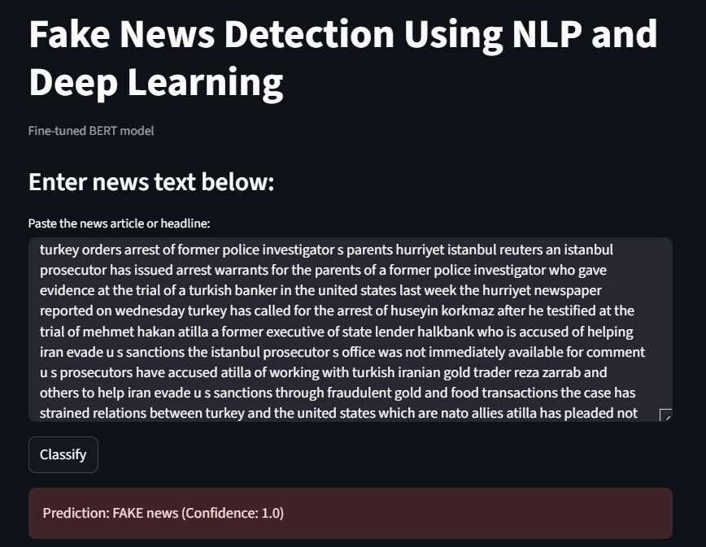
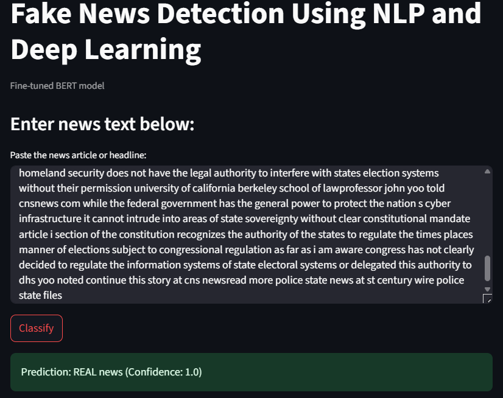

# 📰 Fake News Detection Using Machine Learning and Deep Learning

## 📌 Overview

This project focuses on building a comprehensive fake news detection system using multiple models ranging from traditional machine learning algorithms to deep learning and transformer-based models. The goal is to evaluate different approaches for detecting fake news and deploy the most effective one.

---

## 📁 Project Structure

```
project_root/
├── data/
│   ├── wel_fake/              # WELFake dataset: train.csv, val.csv, test.csv
│   ├── fakenewsnet/           # FakeNewsNet dataset: politifact/gossipcop csvs
├── scripts/
│   ├── preprocess/            # Preprocessing scripts
│   ├── train/                 # Training scripts (train_lstm.py, train_cnn.py, train_bert.py, train_hybrid.py)
│   ├── test/                  # Evaluation scripts (test_lstm.py, test_cnn.py, etc.)
├── outputs/
│   ├── models/                # Saved model weights (.pth)
│   ├── plots/                 # Confusion matrices, charts
│   ├── reports/               # Classification reports in .json and .txt
├── app.py                    # Streamlit app for final demo
├── main.py
└── requirements.txt          # Python dependencies
```

---

## 📊 Datasets Used

### 1. WELFake (Primary Dataset)

* ∼72,000 articles
* Columns: title, text, label (1=real, 0=fake)
* Split: 70% train, 15% val, 15% test

### 2. FakeNewsNet (Generalization Dataset)

* Source: GossipCop and Politifact
* Used only for external testing
* Real-world domain shift test

---

## 🔍 Models Evaluated

We evaluated a wide range of models:

### Traditional ML Models (TF-IDF based)

* Naive Bayes
* Logistic Regression
* Support Vector Machine (SVM)
* Random Forest

### 🧠 Deep Learning Models (PyTorch)

* LSTM + GloVe embeddings
* CNN + GloVe embeddings

### Transformer Model

* Fine-tuned BERT (bert-base-uncased)

### Hybrid Model

* BERT + CNN + BiLSTM
* Fusion of semantic (BERT), local pattern (CNN), and sequence (LSTM)

---

## 📈 Model Performance Summary

| Model               | WELFake Accuracy | WELFake F1 | FakeNewsNet Accuracy | FakeNewsNet F1 |
| ------------------- | ---------------- | ---------- | -------------------- | -------------- |
| Naive Bayes         | 84%              | 0.84       | 64%                  | 0.49           |
| Logistic Regression | 94%              | 0.94       | 73%                  | 0.64           |
| SVM                 | 95%              | 0.95       | 69%                  | 0.65           |
| Random Forest       | 95%              | 0.95       | 75%                  | 0.65           |
| LSTM + GloVe        | 96.8%            | 0.968      | 72.7%                | 0.648          |
| CNN + GloVe         | 96.5%            | 0.965      | 73.2%                | 0.648          |
| Fine-tuned BERT     | 98.2%            | 0.982      | 69.3%                | 0.66           |
| Hybrid Model        | 95.9%            | 0.959      | 71.3%                | 0.651          |

---

## ✅ Final Deployment Choice: Fine-tuned BERT

We chose the Fine-tuned BERT model for final deployment based on:

* ✅ Best performance on in-domain data (WELFake)
* ✅ High precision and recall balance
* ✅ Simpler architecture than hybrid (faster inference)
* ✅ Works well with Streamlit deployment

Although the hybrid model performed decently on cross-domain (FakeNewsNet), its F1-score for fake class detection was lower. BERT offered better performance and stability in live settings.

---

#### 🌐 Streamlit App

A Streamlit app was built for live testing:

* Users can input a news headline or full text
* The model predicts: "REAL" or "FAKE"
* Confidence score is shown

Example Input:


Example Output:


To run the app:

```bash
streamlit run app.py
```

---

## How the Model Classifies News

The models classify based on:

* Writing style (sensational vs. factual)
* Word usage patterns (e.g., clickbait terms)
* Syntax, punctuation, exaggeration
* BERT models learn deep semantic patterns (contextual understanding)

But note: It does not fact-check — it classifies based on how similar the input is to training examples.

---

## 📚 Future Improvements

* Integrate fact-checking APIs
* Try RoBERTa or DistilBERT for lighter inference
* Use attention visualization for explainability
* Train ensemble of models and apply voting

---

## 🙌 Credits

* WELFake dataset by DavanStrien (HuggingFace)
* FakeNewsNet from UIUC research
* HuggingFace Transformers
* Streamlit for interactive UI

---

## Conclusion

This project explored multiple approaches to fake news detection and delivered a practical, interpretable, and high-performing solution using fine-tuned BERT. With support for real-time inference via Streamlit and solid performance across datasets, it’s ready for real-world deployment and academic presentation.

Our hybrid architecture, combining BERT + CNN + BiLSTM, represents a novel experimentation approach that highlights the trade-offs between model complexity and performance across domains.
